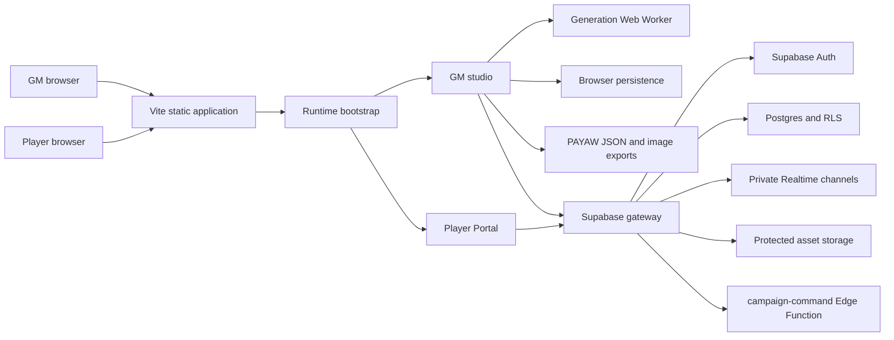
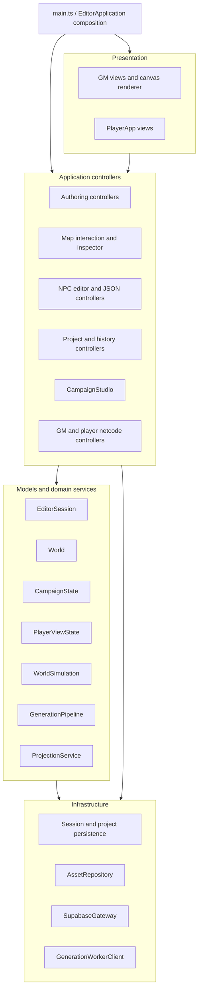
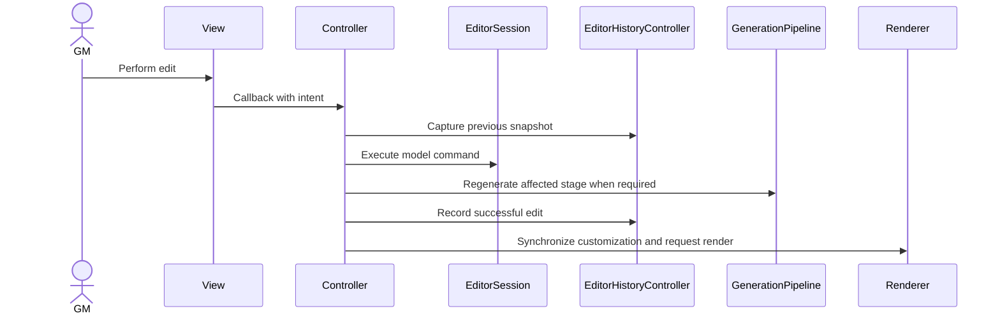
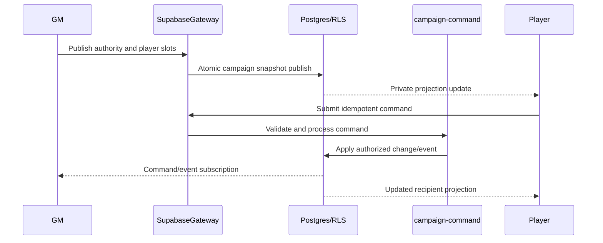

# PAYAW High-Level Design

**System:** PAYAW browser campaign studio

**Release baseline:** v1.0

**Status:** Implemented architecture with an active MVC decomposition

**Last updated:** 2026-08-01

## 1. Purpose

PAYAW is a browser-based campaign studio for generating and authoring a Philippine-inspired region, preparing a tabletop campaign, and running private sessions for connected players.

This document describes the system-level design: runtime surfaces, major components, state ownership, data flows, persistence, hosted networking, security boundaries, and intended module boundaries. Detailed domain rules remain with the source modules and focused test suites.

## 2. Goals and non-goals

### Goals

- Generate the same base world deterministically from the same seed, profile, generation version, and authoring inputs.
- Preserve GM-authored changes across regeneration and seed changes where the authored data remains valid.
- Give the GM one integrated world-authoring and campaign-running application.
- Give each player a recipient-specific view without exposing GM authority data.
- Support offline/local use, portable backups, browser session recovery, and optional hosted play.
- Keep campaign, NPC, map, and simulation state portable and versioned.
- Remain responsive during expensive generation and canvas rendering.

### Non-goals

- PAYAW is not a general-purpose GIS platform.
- It does not provide peer-to-peer authority; the GM and hosted backend remain authoritative.
- Browser local storage is not treated as a durable backup.
- The Player Portal never receives the complete GM project and does not reconstruct hidden campaign state.

## 3. System context



The deployed frontend is a static application. World generation, rendering, local authoring, simulation, and projection construction execute in the browser. Supabase is optional for local-only use and required for hosted rooms.

## 4. Runtime surfaces

`src/bootstrap.ts` selects the runtime before loading feature code.

| Surface | Entry path | Responsibility |
|---|---|---|
| GM studio | Default route | World generation, map authoring, NPC/location authoring, campaign preparation, simulation, project persistence, and hosted-room administration |
| Player projection preview | `?view=player&projection=...` | Render a supplied safe projection without loading the GM application |
| Hosted Player Portal | `?view=player` | Authenticate a player, load their assigned projection, subscribe to updates, and submit permitted commands |

The player branch dynamically imports player modules only. It does not import `EditorApplication`, the GM campaign authority document, or GM-only authoring controls.

## 5. Logical architecture



### 5.1 Architectural style

The GM application is moving toward MVC with a composition root:

- **Models:** `EditorSession`, `World`, `CampaignState`, `PlayerViewState`, authoring records, and simulation state own domain data and commands.
- **Controllers:** purpose-based controllers bind user intent to model commands and infrastructure operations.
- **Views:** canvas and DOM view modules receive state and callbacks; they should not directly own domain mutations.
- **Composition:** `main.ts` only starts the application. `EditorApplication.ts` constructs and connects models, controllers, views, and cross-feature callbacks.

The boundary is not yet complete. `EditorApplication.ts` remains a transitional coordinator and still contains project import, generation orchestration, authoring details, and low-level map pointer behavior. These are documented as known architectural debt rather than intended long-term ownership.

## 6. Major components

| Component | Location | Responsibility |
|---|---|---|
| Runtime bootstrap | `src/bootstrap.ts` | Select GM or player runtime and enforce the initial code-loading boundary |
| GM composition | `src/main.ts`, `src/EditorApplication.ts` | Construct the editor session, engine, renderer, controllers, campaign studio, and netcode panel |
| Editor model | `src/models/EditorSession.ts` | Own mutable editor state, selections, snapshots, and model commands |
| World engine | `src/engine/` | Deterministic generation, world entities, routing, simulation, rendering support, and validation |
| Generation worker | `src/browser/`, `src/workers/` | Run full generation away from the UI thread, report progress, and support cancellation |
| Authoring | `src/authoring/` | Store authored settlements, point features, geometry, terrain edits, and generated-feature overrides |
| Map application | `src/map/`, `src/ui/` | Pointer interaction, camera, inspector, minimap, layers, label display, and map tools |
| NPC application | `src/npc/`, `src/campaign/NPCLocationAuthoring.ts` | NPC editing, schedules, relationships, locations, live placement, and standalone JSON portability |
| Campaign domain | `src/campaign/` | Scenes, timeline, sessions, reveals, messages, clues, objectives, encounters, assets, and checkpoints |
| Player projection | `src/player/ProjectionService.ts` | Construct recipient-specific, bounded, public data from GM authority state |
| Player Portal | `src/player/PlayerApp.ts` | Render projections and expose only supported player actions |
| Hosted networking | `src/netcode/` | Authentication, room administration, projection publication, commands, presence, events, and Realtime subscriptions |
| Project persistence | `src/project/`, `src/session/` | Compact project serialization, import normalization, autosave, recent projects, and browser-session recovery |
| Asset repository | `src/customization/AssetRepository.ts` | Store imported image assets and resolve runtime image data |

## 7. State ownership

| State | Authority | Persistence |
|---|---|---|
| Generated world | `World` and `GenerationPipeline` | Recreated from seed/profile/version; compact recipe in project export |
| Map authoring | `EditorSession` authoring and override collections | Project JSON, autosave, and browser customization storage |
| NPC/location authoring | `EditorSession.npcLocationAuthoring` | Hosted authority and autosave; portable NPCs use dedicated NPC JSON |
| Campaign | `CampaignState` | Project/hosted campaign documents and checkpoints |
| Player access rules | `PlayerViewState` | Project and hosted authority documents |
| Recipient projection | `PlayerProjection` | Per-player hosted slot; treated as derived data |
| Live simulation | `WorldSimulation` | Autosave/project simulation snapshot |
| Imported image binaries | `AssetRepository` | IndexedDB; referenced metadata in project state |
| UI preferences and map camera | Controllers and browser-session state | `localStorage` |
| Resume availability | Session persistence | Cookie marker only; actual session data remains in browser storage |

The deterministic recipe and authored overrides are intentionally separate. Generated entities may be replaced or suppressed, while durable authored intent remains portable across regeneration.

## 8. World generation design

The generation input is:

```text
seed + generation profile + generation version + resolved generation options
```

`GenerationPipeline` runs ordered stages. Each stage receives a deterministic random stream forked by stage ID, so unrelated stages do not share mutable random state.

| Phase | Representative stages |
|---|---|
| Physical terrain | Elevation, mountains, erosion, coastline, slope, climate, hydrology, drainage |
| Authored terrain | Terrain classification and terrain authoring overrides |
| Regional structure | Landmass, islands, settlements, anchors |
| Infrastructure | Roads, authored roads, generated overrides, bridges, ports, accessibility |
| Urban detail | Blocks, land value, zones, zone overrides, naming, buildings |
| World content | Vegetation, story sites, NPC population |

Full generation normally runs through `GenerationWorkerClient`. If Web Workers are unavailable, it falls back to an asynchronous main-thread pipeline that yields between stages.

Cancellation terminates the active worker. Partial regeneration uses `regenerateFrom(stageId)` to rerun only the changed stage and its downstream dependents. Position overrides are validated and recoverable when a regenerated landmass no longer supports the previous location.

## 9. Authoring and undo flow



History stores bounded lightweight editor snapshots. It does not duplicate generated terrain. Undo and redo restore authored state, persist it, and regenerate the affected world representation.

## 10. Project and persistence flows

### 10.1 Portable world project

The v2 portable project uses a compact recipe:

- Seed and generation profile
- Generation and schema metadata
- Map authoring and customization
- Campaign and player-view state
- Simulation snapshot
- Required asset metadata

NPC records are intentionally excluded from portable world customization and are exported as `.npc.json` or `.npc-group.json`. Hosted authority and autosave documents may include NPC authoring because they represent an active complete session rather than the compact interchange format.

All imported JSON is parsed as `unknown`, checked for format and size, and passed through bounded normalizers before it reaches runtime state.

### 10.2 Browser recovery

- Project autosave is periodically written to `localStorage` and on best-effort unload.
- Map camera, visible layers, and active panels are stored as browser-session state.
- A long-lived SameSite cookie records only that recovery may be available.
- Recent projects store lightweight references, not authoritative project backups.
- Imported image binaries use IndexedDB to avoid inflating local-storage records.

Failure to write browser persistence must not corrupt the current in-memory session. Users are still expected to export backups.

## 11. Campaign and simulation design

`CampaignState` is an immutable-style domain model: campaign functions return updated state while recording activity and maintaining schema invariants. It owns scenes, events, clues, handouts, objectives, reveals, messages, notes, sessions, encounters, checkpoints, and the campaign run state.

World identities are referenced by stable keys or explicit entity references. `CampaignStudio` validates external references against the current world, NPC, location, character, and asset catalogs.

`WorldSimulation` owns campaign time, weather, infrastructure conditions, venue status, NPC schedule resolution, and simulation events. Campaign time and simulation time are synchronized by application controllers.

## 12. Player projection and privacy

The GM authority document is never a player payload. `ProjectionService` derives a new `PlayerProjection` for one viewer using:

- Campaign reveals and knowledge grants
- Viewer and party audience rules
- Public character profiles
- Player-safe NPC/location descriptions
- Public map recipe and authorized map features
- Current scenes, objectives, clues, messages, and assets allowed for that viewer

Rumored locations may be deliberately approximate. Canonical IDs are replaced with stable campaign-scoped public IDs where appropriate. Projections are bounded and deep-frozen before use.

The Player Portal parses projections fail-closed. Unsupported schema versions, malformed records, unrevealed entities, GM notes, secrets, hidden schedules, future messages, and unauthorized assets are rejected or absent by default.

## 13. Hosted networking



Hosted data includes campaign rooms, membership, GM authority documents, recipient-specific slots, commands, events, presence, and protected assets. Row-level security separates GM authority from player-visible data. Realtime channels are private and campaign-scoped.

Privileged command processing is confined to the `campaign-command` Edge Function using the service role. The service-role credential must never enter browser code or a `VITE_*` environment variable.

Commands use idempotency keys and revision checks where applicable. Atomic publication avoids exposing player slots from different authority revisions.

## 14. Security boundaries

| Boundary | Enforcement |
|---|---|
| GM code vs player code | Bootstrap-level dynamic import split |
| GM authority vs player projection | Recipient-specific projection construction and parsing |
| Browser user vs hosted records | Supabase Auth and row-level security |
| Untrusted player command vs authority mutation | Edge Function validation, capability checks, idempotency, and campaign membership |
| Imported JSON vs runtime state | Size limits, format checks, bounded normalizers, and schema defaults |
| User-authored text vs DOM | Text nodes and `textContent`; no interpretation as HTML |
| Public frontend configuration vs secrets | Only publishable Supabase and optional Turnstile values are exposed |

Player Portal credentials are backed by Supabase authentication and campaign-scoped database records. Credential reset or reassignment clears obsolete membership/assignment state so cached credentials cannot regain access.

## 15. Performance and scale assumptions

- The primary GM workload is a single active world in one browser tab.
- Generation runs in a disposable worker and reports stage-level progress.
- Canvas layers and raster caches avoid rebuilding unchanged visual data.
- Regeneration starts from the earliest affected stage rather than always rebuilding the entire world.
- Player projections, public roads, buildings, NPC groups, JSON imports, labels, and history are explicitly bounded.
- Realtime publication uses revisions and write reduction to avoid resending unchanged slots.
- Large image binaries are kept outside project autosave payloads where practical.

The design prioritizes deterministic correctness and privacy over multi-user simultaneous GM editing.

## 16. Reliability and compatibility

- Generation metadata carries schema and generation versions.
- Project, campaign, player projection, and browser-session formats are independently versioned.
- Imported older projects are normalized into current runtime state.
- Unsupported player projection versions are rejected.
- Generation cancellation cannot leave a worker consuming CPU.
- Autosave and unload persistence are best effort; explicit JSON export is the durable recovery mechanism.
- Applied database migrations are immutable; changes use new forward migrations.

## 17. Quality strategy

The release gate consists of strict TypeScript compilation, a production Vite build, and focused behavioral suites under `scripts/` and `tests/`.

Coverage areas include:

- Deterministic engine and terrain generation
- Regional settlements, islands, bridges, ports, and maritime routing
- Position recovery and seed-change persistence
- Map, story, zoning, NPC, and location authoring
- Undo/redo and project round trips
- Campaign lifecycle and simulation persistence
- Player projection privacy and hosted synchronization
- Character/social data and player collaboration

The full release command is `pnpm test`; focused suites are available through the `test:*` scripts in `package.json`.

## 18. Repository boundaries

```text
src/authoring/       Authored geometry and generated-feature overrides
src/browser/         Browser-specific generation and runtime adapters
src/campaign/        Campaign, NPC-location, time, and studio domain
src/customization/   Assets, labels, images, and map customization
src/editor/          History and editor persistence
src/engine/          Deterministic world engine and renderer support
src/generation/      Generation UI controller
src/map/             Map input and inspector controllers
src/models/          Application session model
src/netcode/         Supabase gateway and hosted GM/player workflows
src/npc/             NPC controller, view, and JSON portability
src/player/          Player projection, privacy model, and portal
src/project/         Project serialization, recent projects, and controller
src/session/         Browser autosave and session recovery
src/story/           Story objects and encounter generation
src/ui/              GM shell, focused views, and UI controllers
src/workers/         Generation worker entry
supabase/            Database migrations and privileged Edge Function
scripts/             Build and regression-suite runners
tests/               Behavioral test sources
```

## 19. Key design decisions

1. **Recipe plus overrides instead of full-world export.** This keeps portable projects smaller and allows deterministic regeneration.
2. **Dedicated NPC interchange.** NPCs and NPC groups remain portable without inflating compact world files.
3. **Recipient projection instead of client-side hiding.** Private fields are removed before transport.
4. **GM authority with server-validated commands.** Hosted clients do not merge peer-owned campaign state.
5. **Canvas map shared by feature controllers.** GM tools use one renderer/camera state rather than divergent map implementations.
6. **Worker generation with deterministic fallback.** Performance does not change generation semantics.
7. **Purpose-based controllers and views.** Feature ownership replaces milestone-based or monolithic files.

## 20. Known architectural debt and roadmap

The v1.0 implementation is operational but not yet the final MVC shape.

1. Extract project import, autosave, and recovery orchestration from `EditorApplication.ts` into a project application service/controller.
2. Extract generation lifecycle, profile controls, progress, cancellation, and staged regeneration into the generation controller.
3. Move remaining authoring-detail rendering and commands into feature-specific controllers and views.
4. Complete map pointer/drag state ownership inside `MapInteractionController`.
5. Replace remaining public `EditorSession` field mutations with explicit commands and readonly projections.
6. Split the global `AppElements` registry into feature-level element sets as views become independent.
7. Reduce `EditorApplication.ts` to a 300–800-line composition root.

These items are maintainability improvements. They must preserve the release invariants below.

## 21. Release invariants

- The Player Portal never imports or queries the GM authority document.
- A recipient receives only their projection and explicitly public shared state.
- Projection parsing fails closed for unknown versions and malformed data.
- Regeneration preserves valid authored state and reports invalid position recovery.
- World interchange remains compact; NPC portability remains separate.
- Service-role credentials never appear in browser configuration or bundles.
- Hosted writes remain campaign-scoped, authenticated, revisioned, and RLS-protected.
- Imported data is bounded before entering application state.
- User-authored text is rendered as text, not executed markup.
- Applied migrations remain immutable.
